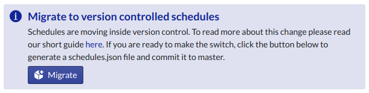
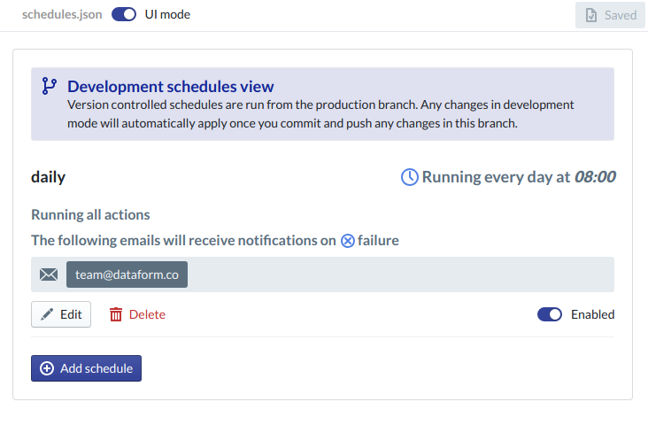

# Version controlled schedules migration

Up until now, schedules configured in Dataform Web have not been part of version control and could only be configured in the production branch.

We felt that this led to a confusing user experience, requiring you to create new files and add them to schedules in seperate places.

Dataform Web now supports a `schedules.json` file as part of your project, which contains a JSON representation of your schedule configuration and is part of version control. This means you can now create new tables and edit schedules as part of a single commit or push.

We've added some tools to simplify migration. Follow the steps below to implement this change.

## 1. Open a clean development branch

Open your Dataform project and go to a clean development branch (or create a new one if you haven't got a clean branch).

## 2. Use the migration tool

On the overview page you should see the following:

## 3. Check your new schedules configuration is correct

After clicking the button, a new file called `schedules.json` will be created. This will automatically open, and you should see the normal schedule configuration page like so.

You can also view the raw JSON by flipping the toggle at the top of the file.

## 4. Commit and push

If you are happy, commit the changes and push them back to production. Once in the production/master branch, they will override the original schedules configured.

As always, please reach out to the team on intercom or at team@dataform.co if you have any questions!
